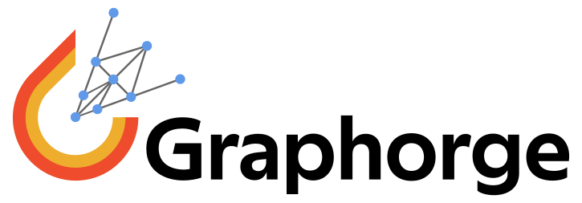

Graphorge
=========

Summary
-------
Graphorge is an open-source Python package built on `PyTorch <https://pytorch.org/>`_ that streamlines the development and evaluation of graph neural networks. It provides a complete workflow encompassing data pre-processing, dataset management, model training, prediction, and result post-processing. Graphorge includes a fully implemented, highly customizable example architecture to demonstrate practical use, and its code is thoroughly documented and commented, making it especially accessible to researchers new to implementing graph neural networks. Although originally developed for computational mechanics, Graphorge’s core functionality is general and can be applied across a wide range of domains.

----

Statement of Need
-----------------
Graph neural networks have emerged as a powerful modeling tool for data with relational or geometric structure. Existing graph neural network libraries tend to fall into two categories. On the one hand, many research-specific implementations are minimally documented and tightly tailored to particular benchmarks. While this may enable results reproducibility, code comprehension is often limited, as well as its customization and generalization to different applications. On the other hand, general purpose frameworks such as `PyTorch Geometric <https://pytorch-geometric.readthedocs.io/en/latest/>`_ and `Deep Graph Library <https://www.dgl.ai/>`_ offer robust, high-performance platforms to implement graph neural networks, usually providing multiple backend support and integration of state-of-the-art scientific contributions.

Graphorge is not intended as an alternative to general-purpose frameworks. Instead, it is designed as a practical and educational tool for researchers and students that aim to understand and be able to implement a full Graph Neural Network pipeline. While only including a single, highly customizable architecture to demonstrate practical use, every single module in Graphorge is extensively documented and commented, aiming to maximize code comprehension. Moreover, rather than abstracting the workflow behind opaque interfaces, Graphorge provides deliberatly fully functional, modular scripts for each stage -- from pre-processing and dataset handling to model training and post-processing -- making it an ideal extensible, starting point for those looking to implement or customize Graph Neural Networks in a research environment.

----

Authorship & Citation
---------------------
Graphorge was originally developed by Bernardo P. Ferreira [#]_.

.. [#] `LinkedIn <https://www.linkedin.com/in/bpferreira/>`_ , `ORCID <https://orcid.org/0000-0001-5956-3877>`_, `ResearchGate <https://www.researchgate.net/profile/Bernardo-Ferreira-11?ev=hdr_xprf>`_

----

Useful Links
------------

* `GitHub repository <https://github.com/BernardoFerreira/graphorge>`_ (source code);

----

Community Support
-----------------

If you find any **issues**, **bugs** or **problems** with Graphorge, please use the `GitHub issue tracker <https://github.com/BernardoFerreira/graphorge/issues>`_ to report them. Provide a clear description of the problem, as well as a complete report on the underlying details, so that it can be easily reproduced and (hopefully) fixed!

You are also welcome to post any **questions**, **comments** or **suggestions** for improvement in the `GitHub discussions <https://github.com/BernardoFerreira/graphorge/discussions>`_ space!

Please refer to Graphorge's `Code of Conduct <https://github.com/BernardoFerreira/graphorge/blob/master/CODE_OF_CONDUCT.md>`_.

----

Credits
-------
* Graphorge is based on the conceptual framework established by `Battaglia and coworkers (2018) <https://arxiv.org/abs/1806.01261>`_ and was inspired by `Google DeepMind research <https://github.com/google-deepmind/deepmind-research>`_, namely the contribution by `Pfaff and coworkers (2021) <https://arxiv.org/abs/2010.03409>`_ and the corresponding `code <https://github.com/google-deepmind/deepmind-research/tree/master/learning_to_simulate>`_.

* Bernardo P. Ferreira is thankful to `Guillaume Broggi <https://github.com/GuillaumeBroggi>`_ for his essential contribution to developing comprehensive benchmarks that illustrate Graphorge's workflow and support the open-source project.

* Bernardo P. Ferreira acknowledges the contribution of `Rui Pinto <https://github.com/ruibmpinto>`_, whose work enabled the seamless handling of time series data.

----

License
-------
Copyright 2023, Bernardo Ferreira

All rights reserved.

Graphorge is a free and open-source software published under a :doc:`MIT License <../license>`.

.. toctree::
   :name: gettingstartedtoc
   :caption: Getting started
   :maxdepth: 3
   :hidden:
   :includehidden:

   rst_doc_files/getting_started/overview.rst
   rst_doc_files/getting_started/installation.rst

.. toctree::
   :name: examplestoc
   :caption: Examples
   :maxdepth: 3
   :hidden:
   :includehidden:

   rst_doc_files/examples/example_workflow.rst
   _collections/examples/readme.md
   _collections/examples/mechanics/gnn_shell_buckling/gnn_shell_buckling.ipynb
   _collections/examples/cfd/gnn_porous_medium/gnn_porous_medium.ipynb

.. toctree::
   :name: apitoc
   :caption: API
   :hidden:

   Code <_autosummary/graphorge>

.. toctree::
   :name: licensetoc
   :caption: License
   :hidden:

   license.rst
  