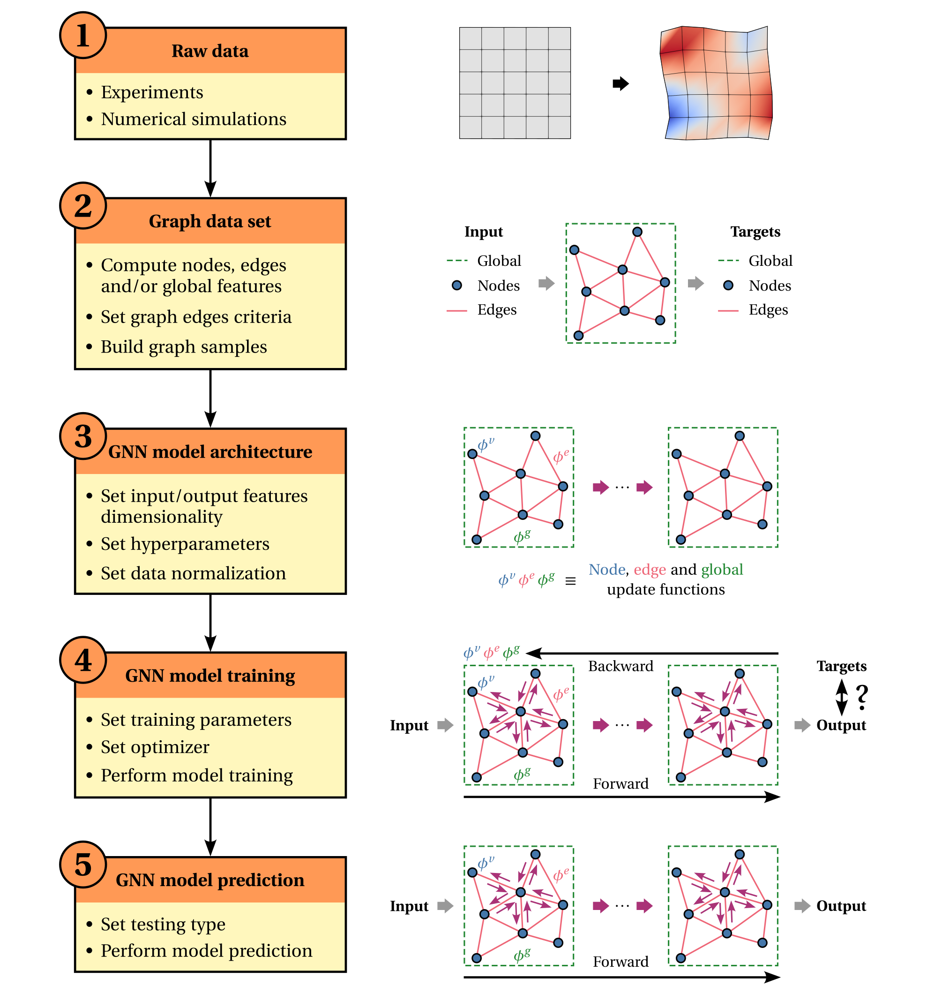

Basic workflow
==============

Graphorge is designed to seamlessly support a wide range of applications. A standard, general-purpose workflow can be summarized in five key steps, as illustrated below. While Graphorge’s modular and object-oriented architecture allows for fully customized implementations, a well-documented workflow implementation is conveniently provided for several benchmarks.

|