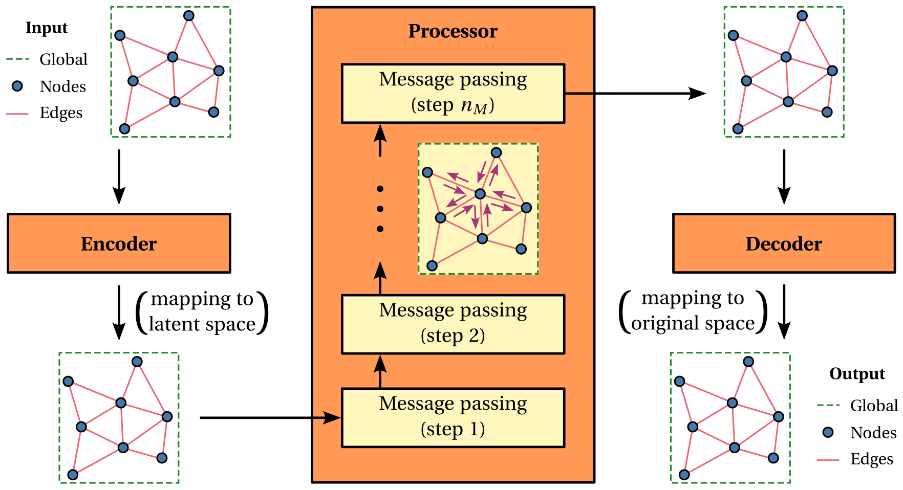

Overview
========

Graphorge is an open-source Python package built on PyTorch that facilitates the development and evaluation of graph neural networks. Unlike general-purpose frameworks that focus on performance, multi-backend support, or a broad collection of pre-implemented models, Graphorge emphasizes clarity and accessibility. It offers a fully functional environment where code readability and understanding take priority, supported by extensively documented and well-structured modules. While some foundational knowledge of graph neural networks and machine learning is still required, Graphorge is ideal for researchers aiming to understand, implement, and customize graph neural networks for a variety of applications.

To meet the aforementioned goals, Graphorge includes a highly customizable graph neural network architecture proposed by `Battaglia and coworkers (2018) <https://arxiv.org/abs/1806.01261>`_ and illustrated below. Reading the referenced paper is essential for a complete understanding of the model’s architecture, implementation, and customization. However, key concepts are summarized below for convenience:

* **Features**. The model supports three types of features: (1) node features, associated with the graph nodes, (2) edge features, associated with the edges between nodes, and (3) global features, associated with the entire graph. These features are customizable based on the problem at hand and can be independently defined for both model inputs and outputs;

* **Data**. In parallel with feature types, the model supports input and output data at the node, edge, and global levels. Note that feature types and data types do not always align. For instance, edge features may be derived exclusively from node-level data. The model is also designed to handle both sequential (typically temporal) and non-sequential (non-temporal) data, providing flexibility for a broad range of applications.

* **Graph Network block**. A Graph Network block is a model architecture unit that performs a graph-to-graph transformation. It enables flexible combinations of feature update functions, which can be implemented as feedforward or recurrent neural networks, and aggregation functions, which define how information is passed between entities and typically involve permutation-invariant operations such as summation or averaging. This design allows the expression of complex relationships among nodes, edges, and global features;

* **Multi-block architecture**. An expressive architecture can be built by combining multiple graph network blocks, each with potentially different internal configurations. A common pattern involves an encoder-processor-decoder configuration, where graph data is encoded into a latent representation, processed through multiple message-passing steps, and finally decoded back into the original feature space.

|

Various use cases of Graphorge are illustrated :doc:`here<../examples/example_workflow>`, showcasing its ability to handle different types of data and features. While the provided model is designed to be easily extended for diverse applications, it also serves as a practical foundation for implementing custom graph neural network models from scratch.
